# Architecture Diagrams
## Airborne Radar Target Behavior Analysis System

**Document Version:** 1.0  
**Date:** November 5, 2025  
**Supplementary to:** TECHNICAL_PROPOSAL.md

---

## Table of Contents

1. [System Architecture Diagrams](#1-system-architecture-diagrams)
2. [Sequence Diagrams](#2-sequence-diagrams)
3. [State Machine Diagrams](#3-state-machine-diagrams)
4. [Component Interaction Diagrams](#4-component-interaction-diagrams)
5. [Data Model Diagrams](#5-data-model-diagrams)

---

## 1. System Architecture Diagrams

### 1.1 Layer Architecture

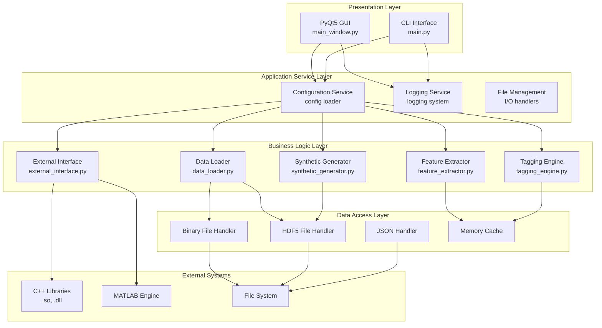

### 1.2 Component Dependency Graph

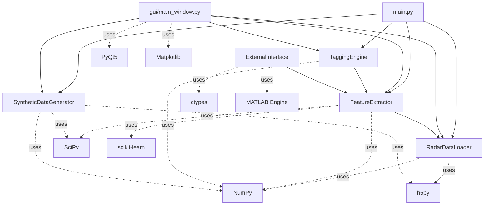

### 1.3 Deployment View

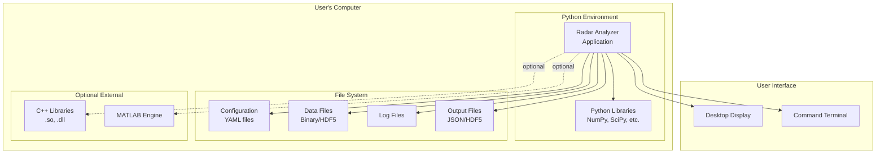

---

## 2. Sequence Diagrams

### 2.1 Complete Analysis Workflow

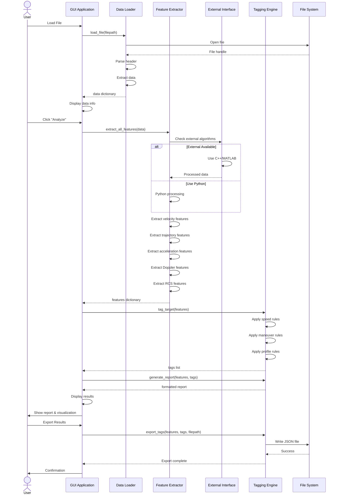

### 2.2 Synthetic Data Generation Sequence

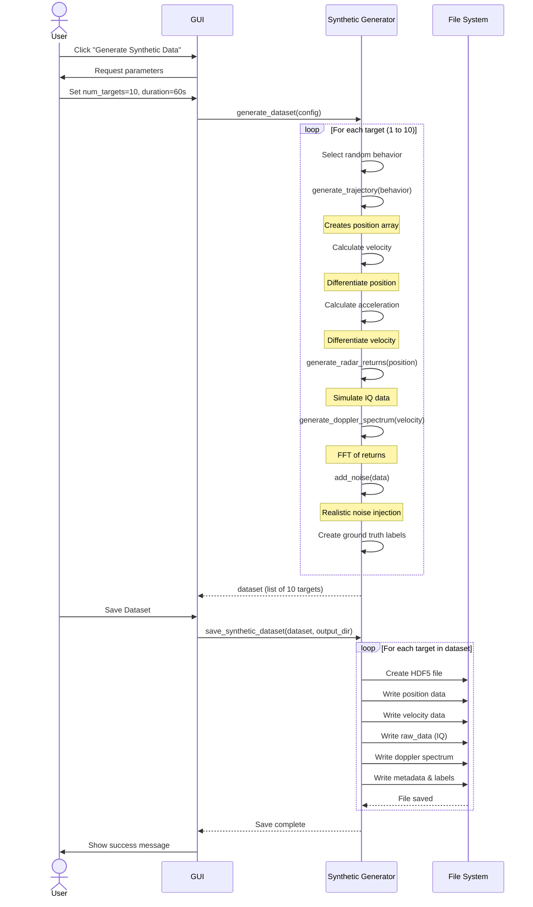

### 2.3 Batch Processing Sequence

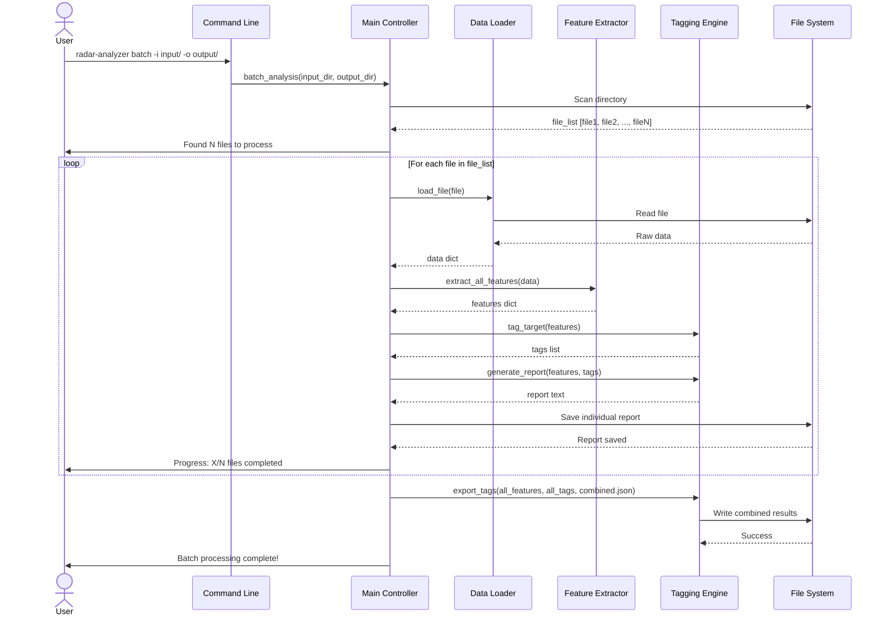

### 2.4 External Algorithm Integration

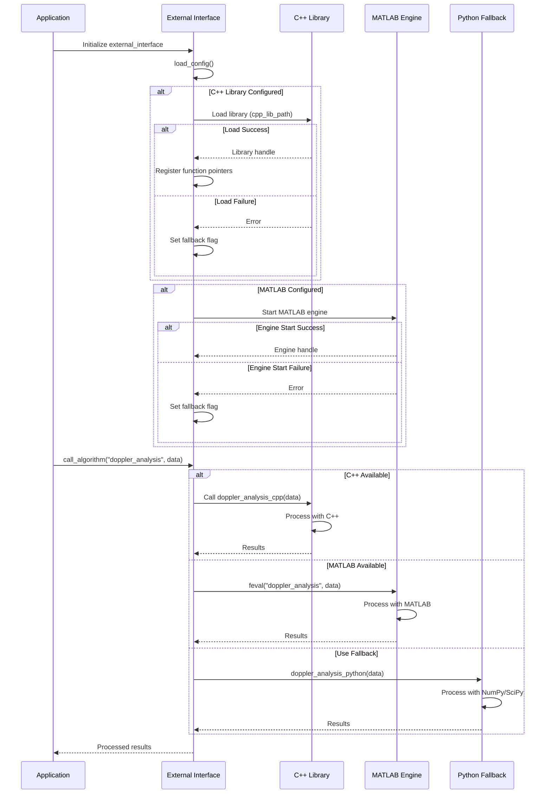

---

## 3. State Machine Diagrams

### 3.1 GUI Application State Machine

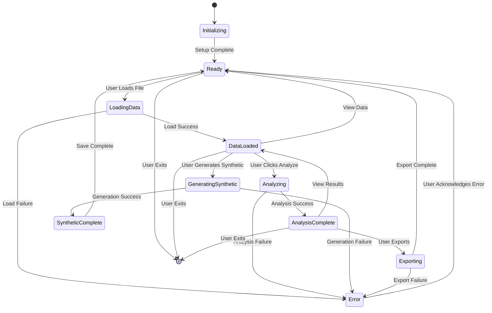

### 3.2 Data Processing State Machine

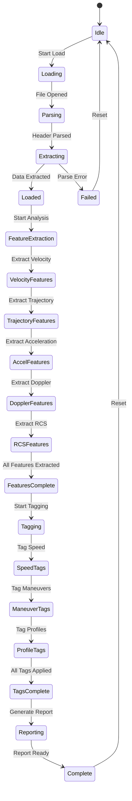

---

## 4. Component Interaction Diagrams

### 4.1 Feature Extraction Data Flow

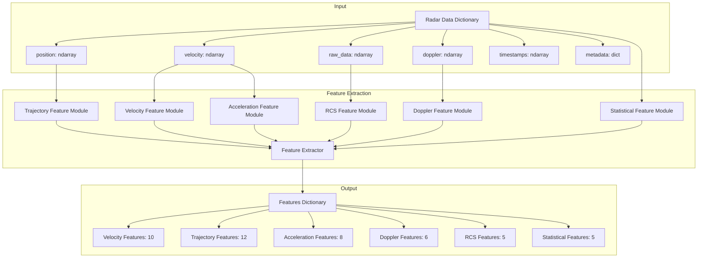

### 4.2 Tagging Engine Decision Flow

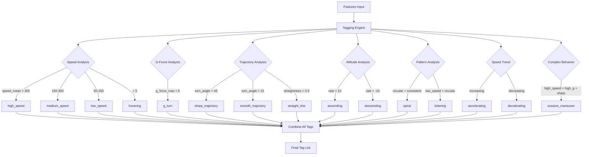

### 4.3 Synthetic Data Generation Pipeline

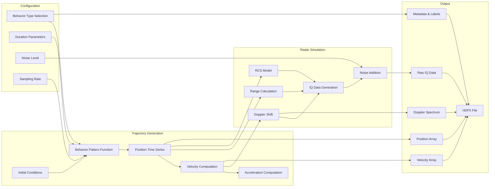

---

## 5. Data Model Diagrams

### 5.1 Radar Data Structure

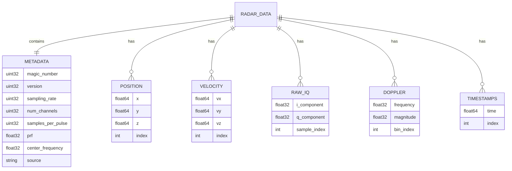

### 5.2 Feature Data Structure

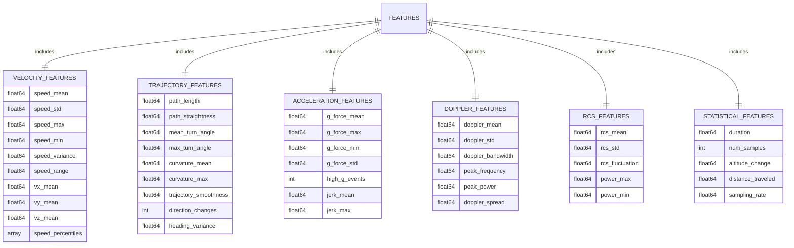

### 5.3 Tag Classification Structure

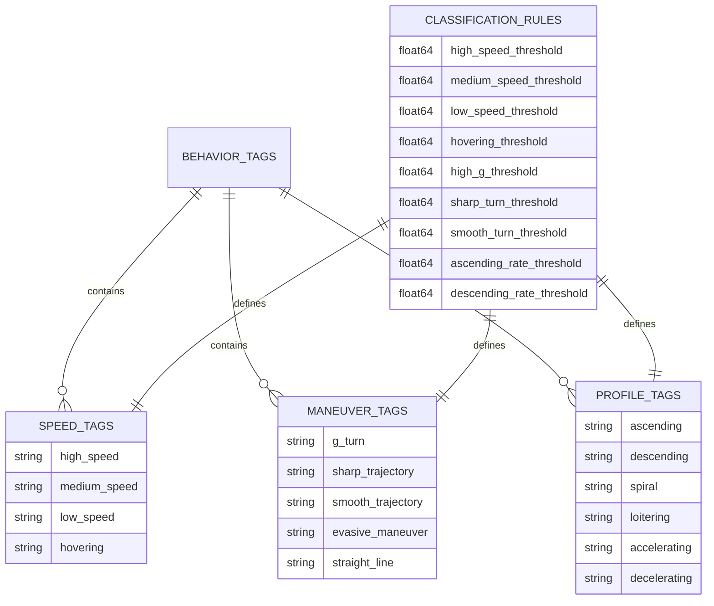

### 5.4 Configuration Structure

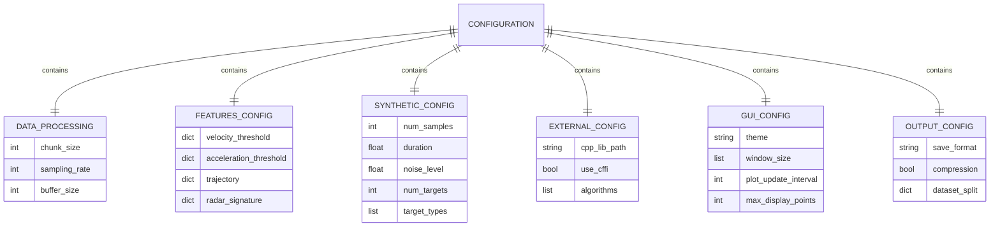

---

## 6. Process Flow Diagrams

### 6.1 Complete System Workflow

```
┌─────────────────────────────────────────────────────────────────┐
│                        System Workflow                           │
└─────────────────────────────────────────────────────────────────┘

    ┌──────────────┐
    │  User Input  │
    └──────┬───────┘
           │
           ├─────────────────┬──────────────┬─────────────────┐
           │                 │              │                 │
    ┌──────▼──────┐   ┌──────▼──────┐  ┌──▼─────────┐  ┌───▼────────┐
    │  GUI Launch │   │  CLI Analyze│  │ CLI Batch  │  │ CLI Generate│
    └──────┬──────┘   └──────┬──────┘  └──┬─────────┘  └───┬────────┘
           │                 │              │                │
           └─────────────────┴──────────────┴────────────────┘
                             │
                    ┌────────▼────────┐
                    │  Configuration  │
                    │     Loading     │
                    └────────┬────────┘
                             │
                    ┌────────▼────────┐
                    │   Data Loading  │
                    │  (Binary/HDF5)  │
                    └────────┬────────┘
                             │
                    ┌────────▼────────┐
                    │    External     │
                    │   Algorithm?    │───No──┐
                    └────────┬────────┘       │
                            Yes               │
                             │                │
                    ┌────────▼────────┐       │
                    │  C++/MATLAB     │       │
                    │   Processing    │       │
                    └────────┬────────┘       │
                             └────────────────┘
                                     │
                            ┌────────▼────────┐
                            │     Feature     │
                            │   Extraction    │
                            │  (40+ features) │
                            └────────┬────────┘
                                     │
                            ┌────────▼────────┐
                            │     Tagging     │
                            │     Engine      │
                            │   (15 tags)     │
                            └────────┬────────┘
                                     │
                            ┌────────▼────────┐
                            │     Report      │
                            │   Generation    │
                            └────────┬────────┘
                                     │
                         ┌───────────┴───────────┐
                         │                       │
                ┌────────▼────────┐     ┌───────▼────────┐
                │  Display in GUI │     │  Export to File│
                └─────────────────┘     │  (JSON/HDF5)   │
                                        └────────────────┘
```

### 6.2 Error Handling Flow

```
┌─────────────────────────────────────────────────────────────────┐
│                      Error Handling Flow                         │
└─────────────────────────────────────────────────────────────────┘

    ┌──────────────┐
    │  Operation   │
    │   Attempt    │
    └──────┬───────┘
           │
    ┌──────▼───────┐
    │  Try Execute │
    └──────┬───────┘
           │
           ├───Success───►┌────────────┐
           │              │   Return   │
           │              │  Results   │
           │              └────────────┘
           │
           └───Failure───►┌────────────┐
                          │   Catch    │
                          │  Exception │
                          └──────┬─────┘
                                 │
                        ┌────────▼────────┐
                        │   Log Error     │
                        │ (with context)  │
                        └────────┬────────┘
                                 │
                        ┌────────▼────────────┐
                        │ Can Fallback/Retry? │
                        └─────────┬───────────┘
                                  │
                    ┌─────────────┼─────────────┐
                   Yes                          No
                    │                            │
           ┌────────▼────────┐          ┌───────▼────────┐
           │  Use Fallback   │          │  Show User     │
           │  Implementation │          │     Error      │
           └────────┬────────┘          │    Message     │
                    │                   └───────┬────────┘
                    │                           │
           ┌────────▼────────┐          ┌───────▼────────┐
           │  Log Fallback   │          │   Allow User   │
           │      Usage      │          │   to Retry/    │
           └────────┬────────┘          │    Cancel      │
                    │                   └────────────────┘
           ┌────────▼────────┐
           │  Continue with  │
           │    Fallback     │
           └─────────────────┘
```

---

**Document End**

**Prepared by:** AI System Architect  
**Date:** November 5, 2025  
**Version:** 1.0  
**Companion to:** TECHNICAL_PROPOSAL.md
