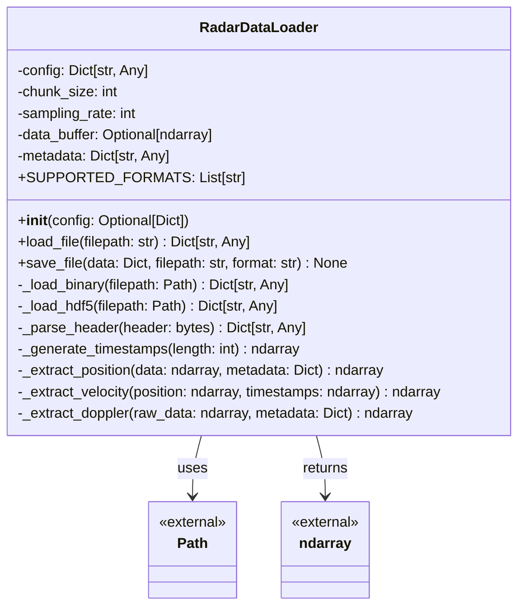
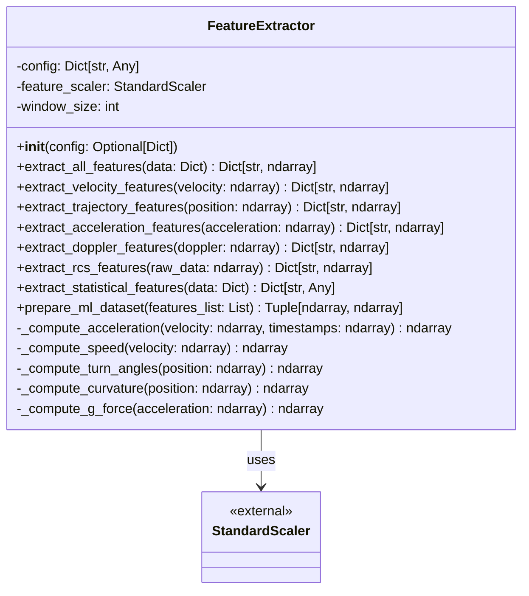
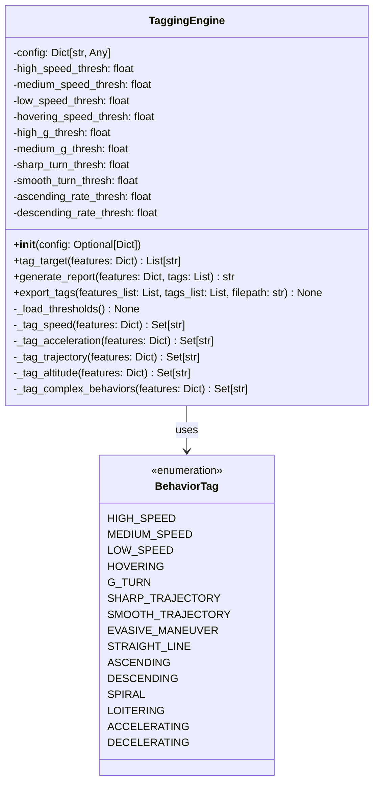
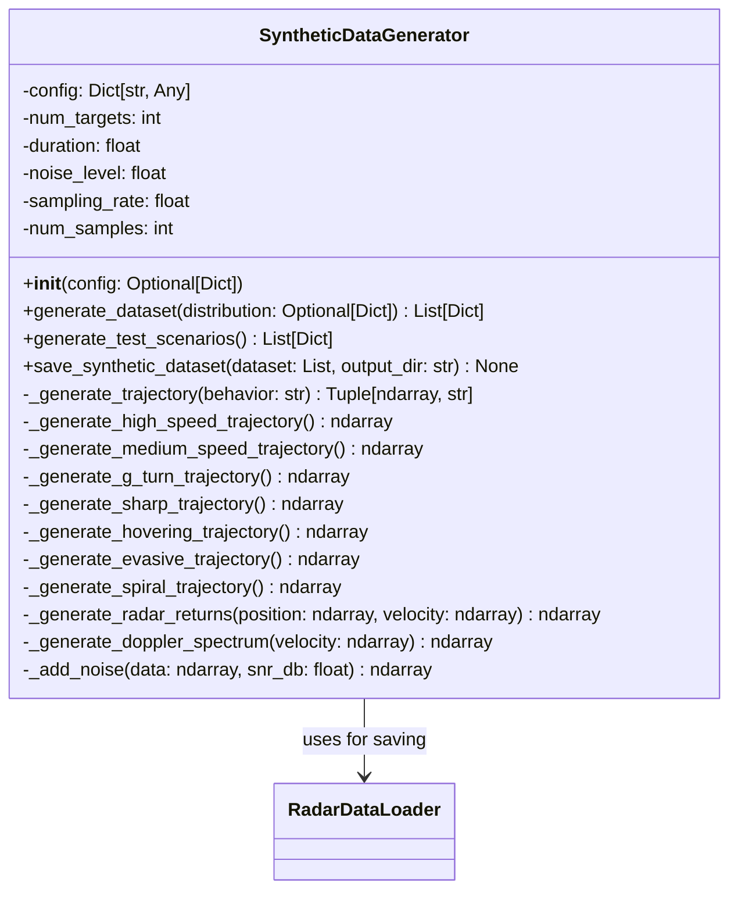
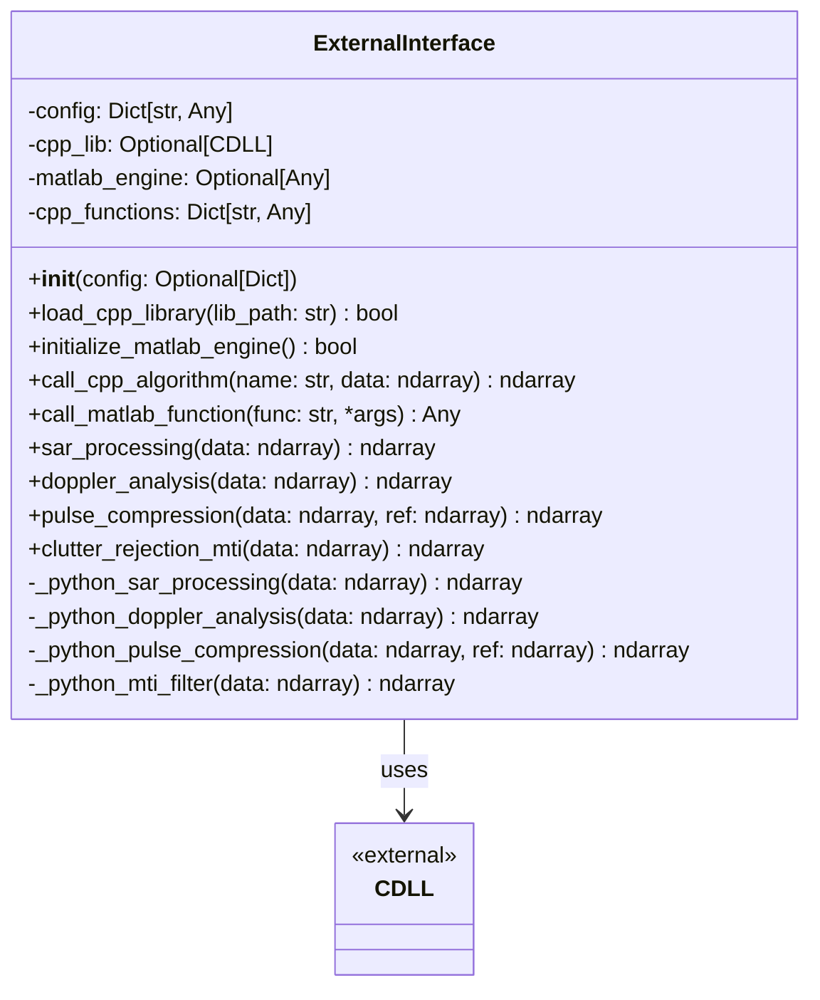
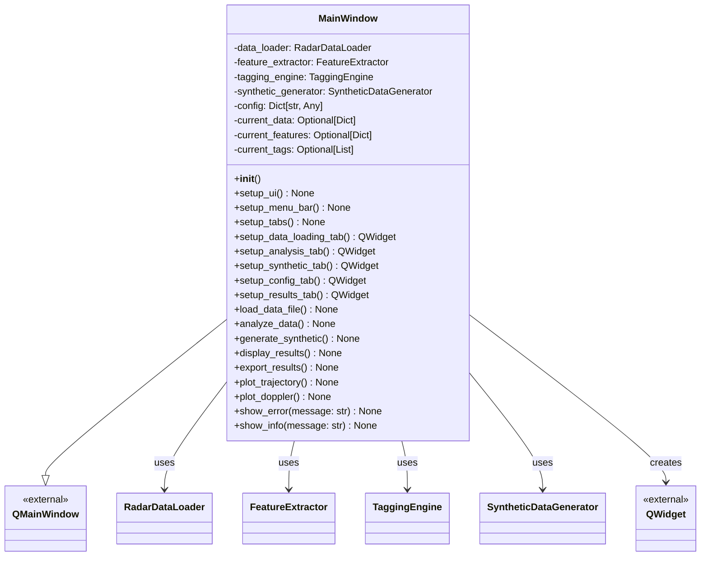

# UML Specifications and Implementation Details
## Airborne Radar Target Behavior Analysis System

**Document Version:** 1.0  
**Date:** November 5, 2025  
**Supplementary to:** TECHNICAL_PROPOSAL.md

---

## Table of Contents

1. [Detailed Class Diagrams](#1-detailed-class-diagrams)
2. [Interface Specifications](#2-interface-specifications)
3. [Data Transfer Objects](#3-data-transfer-objects)
4. [Algorithm Specifications](#4-algorithm-specifications)
5. [Implementation Patterns](#5-implementation-patterns)

---

## 1. Detailed Class Diagrams

### 1.1 RadarDataLoader Class



**Method Specifications:**

```python
class RadarDataLoader:
    """
    Loader for binary and HDF5 radar data files.
    
    Attributes:
        config (Dict): Configuration dictionary
        chunk_size (int): Number of samples to process at once
        sampling_rate (int): Sampling rate in Hz
        data_buffer (Optional[ndarray]): Internal data buffer
        metadata (Dict): File metadata
        SUPPORTED_FORMATS (List[str]): Supported file extensions
    """
    
    def load_file(self, filepath: str) -> Dict[str, Any]:
        """
        Load radar data from file.
        
        Args:
            filepath: Path to radar data file
            
        Returns:
            Dictionary containing:
                - raw_data: Complex IQ samples (ndarray)
                - position: Position array Nx3 (ndarray)
                - velocity: Velocity array Nx3 (ndarray)
                - doppler: Doppler spectrum (ndarray)
                - timestamps: Time array (ndarray)
                - metadata: File metadata (dict)
                
        Raises:
            FileNotFoundError: If file doesn't exist
            ValueError: If file format is unsupported
            IOError: If file cannot be read
        """
    
    def save_file(self, data: Dict, filepath: str, format: str = 'hdf5') -> None:
        """
        Save processed data to file.
        
        Args:
            data: Data dictionary to save
            filepath: Output file path
            format: Output format ('hdf5', 'npz', or 'json')
            
        Raises:
            ValueError: If format is invalid
            IOError: If file cannot be written
        """
```

### 1.2 FeatureExtractor Class



**Feature Extraction Algorithms:**

```python
class FeatureExtractor:
    """
    Extract features from radar data.
    
    Feature Categories:
    - Velocity: speed metrics, components, trends
    - Trajectory: path analysis, turns, curvature
    - Acceleration: G-forces, jerk, maneuvers
    - Doppler: spectrum analysis, peaks
    - RCS: power levels, fluctuation
    - Statistical: duration, counts, metadata
    """
    
    def extract_velocity_features(self, velocity: ndarray) -> Dict[str, ndarray]:
        """
        Extract velocity-based features.
        
        Algorithm:
        1. Compute speed = ||velocity||
        2. Calculate statistics: mean, std, max, min, variance
        3. Compute percentiles: p25, p50, p75, p90
        4. Extract velocity components: vx_mean, vy_mean, vz_mean
        5. Analyze speed trends: increasing/decreasing
        
        Returns:
            Dictionary with 10+ velocity features
        """
    
    def extract_trajectory_features(self, position: ndarray) -> Dict[str, ndarray]:
        """
        Extract trajectory-based features.
        
        Algorithm:
        1. Compute path_length = Σ||Δposition||
        2. Calculate straightness = euclidean_dist / path_length
        3. Compute turn angles between consecutive segments
        4. Calculate curvature at each point
        5. Measure trajectory smoothness (jerk in direction)
        6. Count direction changes
        
        Returns:
            Dictionary with 12+ trajectory features
        """
    
    def extract_acceleration_features(self, acceleration: ndarray) -> Dict:
        """
        Extract acceleration-based features.
        
        Algorithm:
        1. Compute G-force = ||acceleration|| / 9.81
        2. Calculate G-force statistics: mean, max, min, std
        3. Count high-G events (> threshold)
        4. Compute jerk = d(acceleration)/dt
        5. Calculate jerk statistics
        
        Returns:
            Dictionary with 8+ acceleration features
        """
```

### 1.3 TaggingEngine Class



**Tagging Algorithms:**

```python
class TaggingEngine:
    """
    Tag radar targets based on behavior patterns.
    
    Tagging Rules:
    - Speed-based: Compare speed_mean with thresholds
    - Maneuver-based: Analyze G-force and turn angles
    - Profile-based: Examine altitude rate and patterns
    - Complex: Combine multiple criteria
    """
    
    def _tag_speed(self, features: Dict) -> Set[str]:
        """
        Tag based on speed analysis.
        
        Rules:
        - high_speed: speed_mean > 300 m/s
        - medium_speed: 150 < speed_mean <= 300 m/s
        - low_speed: 50 < speed_mean <= 150 m/s
        - hovering: speed_mean <= 5 m/s
        
        Returns:
            Set of speed-related tags
        """
    
    def _tag_acceleration(self, features: Dict) -> Set[str]:
        """
        Tag based on acceleration analysis.
        
        Rules:
        - g_turn: g_force_max > 5.0g
        
        Returns:
            Set of acceleration-related tags
        """
    
    def _tag_trajectory(self, features: Dict) -> Set[str]:
        """
        Tag based on trajectory analysis.
        
        Rules:
        - sharp_trajectory: mean_turn_angle > 45°
        - smooth_trajectory: mean_turn_angle < 15°
        - straight_line: path_straightness > 0.9
        
        Returns:
            Set of trajectory-related tags
        """
    
    def _tag_complex_behaviors(self, features: Dict) -> Set[str]:
        """
        Tag complex behavior patterns.
        
        Rules:
        - evasive_maneuver: high_speed + high_g + sharp_trajectory
        - spiral: circular pattern + consistent turn rate
        - loitering: low_speed + circular pattern
        
        Returns:
            Set of complex behavior tags
        """
```

### 1.4 SyntheticDataGenerator Class



**Trajectory Generation Algorithms:**

```python
class SyntheticDataGenerator:
    """
    Generate synthetic radar data with realistic behaviors.
    
    Trajectory Models:
    - High-speed: Linear with small perturbations
    - Medium-speed: Straight with gentle turns
    - G-turn: Tight circular maneuver
    - Sharp: Zigzag pattern with sudden direction changes
    - Hovering: Stationary with small drift
    - Evasive: Combination of speed changes and sharp turns
    - Spiral: Helical 3D trajectory
    """
    
    def _generate_high_speed_trajectory(self) -> ndarray:
        """
        Generate high-speed intercept trajectory.
        
        Algorithm:
        1. Set initial velocity: 300-400 m/s
        2. Add small random perturbations (< 5%)
        3. Integrate to get position
        4. Duration: 30-60 seconds
        
        Returns:
            Position array (N, 3)
        """
    
    def _generate_g_turn_trajectory(self) -> ndarray:
        """
        Generate high-G turn maneuver.
        
        Algorithm:
        1. Start with straight-line flight
        2. Execute circular turn at 6-8g
        3. Turn radius = v²/(g * 9.81)
        4. Complete 180-360° turn
        5. Return to straight flight
        
        Returns:
            Position array (N, 3)
        """
    
    def _generate_radar_returns(self, position: ndarray, 
                                 velocity: ndarray) -> ndarray:
        """
        Generate synthetic radar returns (IQ data).
        
        Algorithm:
        1. Compute range = ||position||
        2. Calculate Doppler shift = 2*v_radial/λ
        3. Generate complex baseband signal
        4. Add multipath effects
        5. Apply RCS model
        
        Returns:
            Complex IQ samples
        """
```

### 1.5 ExternalInterface Class



**External Integration Specifications:**

```python
class ExternalInterface:
    """
    Interface for external C++ and MATLAB algorithms.
    
    Integration Methods:
    - C++: ctypes with shared library loading
    - MATLAB: MATLAB Engine API
    - Fallback: Pure Python implementations
    """
    
    def load_cpp_library(self, lib_path: str) -> bool:
        """
        Load C++ shared library.
        
        Process:
        1. Verify file exists
        2. Load library with ctypes.CDLL
        3. Register function pointers
        4. Set argument and return types
        5. Test with dummy call
        
        Returns:
            True if successful, False otherwise
        """
    
    def call_cpp_algorithm(self, name: str, data: ndarray) -> ndarray:
        """
        Call C++ algorithm with error handling.
        
        Process:
        1. Check if library loaded
        2. Prepare data (convert to C types)
        3. Call C++ function
        4. Handle errors/exceptions
        5. Convert results back to NumPy
        6. Fallback to Python if failure
        
        Returns:
            Processed data
        """
    
    def _python_sar_processing(self, data: ndarray) -> ndarray:
        """
        Python fallback for SAR processing.
        
        Algorithm:
        1. Range compression (matched filter)
        2. Range cell migration correction
        3. Azimuth compression
        4. Image formation
        
        Returns:
            SAR image
        """
```

### 1.6 MainWindow (GUI) Class



---

## 2. Interface Specifications

### 2.1 Data Loading Interface

```python
from typing import Dict, Any, Optional
from pathlib import Path
import numpy as np

class IDataLoader:
    """Interface for data loading implementations."""
    
    def load_file(self, filepath: str) -> Dict[str, Any]:
        """
        Load data from file.
        
        Args:
            filepath: Path to data file
            
        Returns:
            Data dictionary with standardized structure
        """
        raise NotImplementedError
    
    def save_file(self, data: Dict, filepath: str, format: str) -> None:
        """
        Save data to file.
        
        Args:
            data: Data dictionary
            filepath: Output file path
            format: Output format
        """
        raise NotImplementedError
    
    @property
    def supported_formats(self) -> list:
        """Return list of supported file formats."""
        raise NotImplementedError


class BinaryFileLoader(IDataLoader):
    """Implementation for binary files."""
    
    supported_formats = ['bin', 'dat']
    
    def load_file(self, filepath: str) -> Dict[str, Any]:
        # Implementation for binary format
        pass


class HDF5FileLoader(IDataLoader):
    """Implementation for HDF5 files."""
    
    supported_formats = ['h5', 'hdf5']
    
    def load_file(self, filepath: str) -> Dict[str, Any]:
        # Implementation for HDF5 format
        pass
```

### 2.2 Feature Extraction Interface

```python
from typing import Dict, List
import numpy as np

class IFeatureExtractor:
    """Interface for feature extraction implementations."""
    
    def extract_features(self, data: Dict) -> Dict[str, np.ndarray]:
        """
        Extract features from data.
        
        Args:
            data: Input data dictionary
            
        Returns:
            Features dictionary
        """
        raise NotImplementedError
    
    @property
    def feature_names(self) -> List[str]:
        """Return list of extracted feature names."""
        raise NotImplementedError


class VelocityFeatureExtractor(IFeatureExtractor):
    """Extract velocity-based features."""
    
    feature_names = [
        'speed_mean', 'speed_std', 'speed_max', 'speed_min',
        'vx_mean', 'vy_mean', 'vz_mean', 'speed_variance'
    ]


class TrajectoryFeatureExtractor(IFeatureExtractor):
    """Extract trajectory-based features."""
    
    feature_names = [
        'path_length', 'mean_turn_angle', 'curvature_mean',
        'trajectory_smoothness', 'direction_changes'
    ]
```

### 2.3 Tagging Interface

```python
from typing import Dict, List, Set
from enum import Enum

class BehaviorTag(Enum):
    """Enumeration of all behavior tags."""
    HIGH_SPEED = "high_speed"
    MEDIUM_SPEED = "medium_speed"
    LOW_SPEED = "low_speed"
    # ... more tags

class ITagger:
    """Interface for tagging implementations."""
    
    def tag(self, features: Dict) -> List[str]:
        """
        Tag target based on features.
        
        Args:
            features: Feature dictionary
            
        Returns:
            List of behavior tags
        """
        raise NotImplementedError
    
    def get_available_tags(self) -> List[str]:
        """Return list of all available tags."""
        raise NotImplementedError


class RuleBasedTagger(ITagger):
    """Rule-based tagging implementation."""
    
    def tag(self, features: Dict) -> List[str]:
        tags = []
        # Apply rules
        return tags


class MLBasedTagger(ITagger):
    """Machine learning-based tagging (future)."""
    
    def __init__(self, model_path: str):
        self.model = self._load_model(model_path)
    
    def tag(self, features: Dict) -> List[str]:
        # Use trained model
        pass
```

---

## 3. Data Transfer Objects

### 3.1 Radar Data DTO

```python
from dataclasses import dataclass
from typing import Optional
import numpy as np

@dataclass
class RadarMetadata:
    """Metadata for radar data file."""
    magic_number: int
    version: int
    sampling_rate: float
    num_channels: int
    samples_per_pulse: int
    prf: float  # Pulse Repetition Frequency
    center_frequency: float
    source: str
    timestamp: Optional[str] = None


@dataclass
class RadarData:
    """Complete radar data structure."""
    raw_data: np.ndarray  # Complex IQ samples
    position: np.ndarray  # (N, 3) array
    velocity: np.ndarray  # (N, 3) array
    doppler: np.ndarray   # Doppler spectrum
    timestamps: np.ndarray  # Time array
    metadata: RadarMetadata
    
    def __post_init__(self):
        """Validate data dimensions."""
        assert self.position.shape[1] == 3, "Position must be Nx3"
        assert self.velocity.shape[1] == 3, "Velocity must be Nx3"
        assert len(self.position) == len(self.velocity), "Length mismatch"
```

### 3.2 Features DTO

```python
from dataclasses import dataclass
from typing import Dict, Any
import numpy as np

@dataclass
class VelocityFeatures:
    """Velocity-based features."""
    speed_mean: float
    speed_std: float
    speed_max: float
    speed_min: float
    speed_variance: float
    vx_mean: float
    vy_mean: float
    vz_mean: float
    speed_percentiles: np.ndarray  # [p25, p50, p75, p90]


@dataclass
class TrajectoryFeatures:
    """Trajectory-based features."""
    path_length: float
    path_straightness: float
    mean_turn_angle: float
    max_turn_angle: float
    curvature_mean: float
    curvature_max: float
    trajectory_smoothness: float
    direction_changes: int


@dataclass
class TargetFeatures:
    """Complete feature set for a target."""
    velocity: VelocityFeatures
    trajectory: TrajectoryFeatures
    acceleration: Dict[str, float]
    doppler: Dict[str, float]
    rcs: Dict[str, float]
    statistical: Dict[str, Any]
    
    def to_dict(self) -> Dict[str, Any]:
        """Convert to flat dictionary for ML."""
        return {
            **vars(self.velocity),
            **vars(self.trajectory),
            **self.acceleration,
            **self.doppler,
            **self.rcs,
            **self.statistical
        }
```

### 3.3 Analysis Result DTO

```python
from dataclasses import dataclass
from typing import List, Dict, Any
from datetime import datetime

@dataclass
class AnalysisResult:
    """Complete analysis result."""
    filename: str
    timestamp: datetime
    features: TargetFeatures
    tags: List[str]
    confidence: Dict[str, float]  # Confidence per tag
    report: str
    
    def to_json(self) -> Dict[str, Any]:
        """Convert to JSON-serializable format."""
        return {
            'filename': self.filename,
            'timestamp': self.timestamp.isoformat(),
            'features': self.features.to_dict(),
            'tags': self.tags,
            'confidence': self.confidence,
            'report': self.report
        }
```

---

## 4. Algorithm Specifications

### 4.1 Feature Extraction Algorithms

#### Velocity Features Algorithm

```
Algorithm: Extract Velocity Features
Input: velocity array (N, 3)
Output: Dictionary of velocity features

1. Compute speed vector:
   speed[i] = ||velocity[i]|| for i = 0 to N-1
   
2. Calculate statistics:
   speed_mean = mean(speed)
   speed_std = std(speed)
   speed_max = max(speed)
   speed_min = min(speed)
   speed_variance = var(speed)
   speed_range = speed_max - speed_min
   
3. Compute percentiles:
   p25 = percentile(speed, 25)
   p50 = percentile(speed, 50)  # median
   p75 = percentile(speed, 75)
   p90 = percentile(speed, 90)
   
4. Extract velocity components:
   vx_mean = mean(velocity[:, 0])
   vy_mean = mean(velocity[:, 1])
   vz_mean = mean(velocity[:, 2])
   
5. Analyze trends:
   If linear_regression(speed, time).slope > threshold:
       speed_trend = "accelerating"
   Else if slope < -threshold:
       speed_trend = "decelerating"
   
Return feature dictionary
```

#### Trajectory Features Algorithm

```
Algorithm: Extract Trajectory Features
Input: position array (N, 3)
Output: Dictionary of trajectory features

1. Compute path length:
   segments = position[1:] - position[:-1]
   segment_lengths = ||segments||
   path_length = sum(segment_lengths)
   
2. Calculate straightness:
   euclidean_distance = ||position[-1] - position[0]||
   path_straightness = euclidean_distance / path_length
   
3. Compute turn angles:
   For i = 1 to N-2:
       v1 = position[i] - position[i-1]
       v2 = position[i+1] - position[i]
       angle[i] = arccos(dot(v1, v2) / (||v1|| * ||v2||))
   
   mean_turn_angle = mean(angle)
   max_turn_angle = max(angle)
   
4. Calculate curvature:
   For i = 1 to N-2:
       curvature[i] = ||acceleration[i]|| / speed[i]²
   
   curvature_mean = mean(curvature)
   curvature_max = max(curvature)
   
5. Measure smoothness:
   trajectory_smoothness = std(angle) / mean(angle)
   
6. Count direction changes:
   direction_changes = count(|angle| > threshold)
   
Return feature dictionary
```

#### G-Force Calculation Algorithm

```
Algorithm: Compute G-Force
Input: acceleration array (N, 3), timestamps array (N,)
Output: G-force array (N,)

1. Compute acceleration magnitude:
   accel_mag[i] = ||acceleration[i]|| for i = 0 to N-1
   
2. Convert to G-force:
   g = 9.81  # m/s²
   g_force[i] = accel_mag[i] / g
   
3. Extract statistics:
   g_force_mean = mean(g_force)
   g_force_max = max(g_force)
   g_force_min = min(g_force)
   g_force_std = std(g_force)
   
4. Count high-G events:
   high_g_threshold = 5.0  # From config
   high_g_events = count(g_force > high_g_threshold)
   
5. Compute jerk (rate of change of acceleration):
   dt = diff(timestamps)
   jerk = diff(accel_mag) / dt
   jerk_mean = mean(|jerk|)
   jerk_max = max(|jerk|)
   
Return g_force array and statistics
```

### 4.2 Tagging Algorithms

#### Speed-Based Tagging

```
Algorithm: Tag Speed
Input: features dictionary
Output: Set of speed tags

speed_mean = features['speed_mean']

tags = empty_set()

If speed_mean > high_speed_threshold:
    tags.add("high_speed")
Else If speed_mean > medium_speed_threshold:
    tags.add("medium_speed")
Else If speed_mean > low_speed_threshold:
    tags.add("low_speed")
Else If speed_mean < hovering_threshold:
    tags.add("hovering")

Return tags
```

#### Complex Behavior Detection

```
Algorithm: Detect Evasive Maneuver
Input: features dictionary, existing tags
Output: Set of complex behavior tags

tags = empty_set()

# Evasive maneuver requires:
# 1. High speed OR rapid acceleration
# 2. High G-force turns
# 3. Sharp trajectory changes

has_high_speed = "high_speed" in existing_tags OR features['speed_mean'] > 250
has_high_g = features['g_force_max'] > 4.0
has_sharp_turns = features['mean_turn_angle'] > 40

If has_high_speed AND has_high_g AND has_sharp_turns:
    tags.add("evasive_maneuver")

# Spiral pattern detection
is_circular = features['path_straightness'] < 0.6
has_consistent_turns = features['turn_angle_std'] < 10.0

If is_circular AND has_consistent_turns:
    If "low_speed" in existing_tags:
        tags.add("loitering")
    Else:
        tags.add("spiral")

Return tags
```

### 4.3 Synthetic Data Generation Algorithms

#### High-G Turn Generation

```
Algorithm: Generate High-G Turn Trajectory
Input: initial_position, initial_velocity, turn_rate, duration
Output: position array (N, 3)

1. Initialize parameters:
   dt = 0.1  # seconds
   N = int(duration / dt)
   g = 9.81  # m/s²
   
2. Calculate turn radius:
   v = ||initial_velocity||
   g_force = 6.0  # Target 6g turn
   centripetal_accel = g_force * g
   radius = v² / centripetal_accel
   
3. Generate circular trajectory:
   angular_velocity = v / radius
   
   For i = 0 to N-1:
       t = i * dt
       angle = angular_velocity * t
       
       # Position on circle
       position[i, 0] = initial_position[0] + radius * cos(angle)
       position[i, 1] = initial_position[1] + radius * sin(angle)
       position[i, 2] = initial_position[2]  # Constant altitude
       
4. Add realistic noise:
   noise = random_normal(0, 0.01 * radius, size=(N, 3))
   position += noise
   
Return position
```

#### Radar Return Simulation

```
Algorithm: Generate Radar Returns (IQ Data)
Input: position array, velocity array, carrier_frequency, sampling_rate
Output: Complex IQ samples

1. Initialize parameters:
   c = 3e8  # Speed of light (m/s)
   wavelength = c / carrier_frequency
   N = len(position)
   
2. Compute range to radar:
   For i = 0 to N-1:
       range[i] = ||position[i]||
   
3. Calculate Doppler shift:
   For i = 0 to N-1:
       v_radial[i] = dot(velocity[i], position[i]) / range[i]
       doppler_shift[i] = 2 * v_radial[i] / wavelength
   
4. Generate complex baseband signal:
   For i = 0 to N-1:
       phase = 4 * π * range[i] / wavelength
       amplitude = 1.0 / (range[i]²)  # Free-space path loss
       
       # Add Doppler modulation
       phase += 2 * π * doppler_shift[i] * t[i]
       
       iq_data[i] = amplitude * exp(1j * phase)
   
5. Add noise:
   snr_db = 20  # Target SNR
   noise_power = signal_power / (10^(snr_db/10))
   noise = sqrt(noise_power/2) * (randn(N) + 1j*randn(N))
   iq_data += noise
   
Return iq_data
```

---

## 5. Implementation Patterns

### 5.1 Factory Pattern for Data Loaders

```python
class DataLoaderFactory:
    """Factory for creating appropriate data loaders."""
    
    _loaders = {
        'bin': BinaryFileLoader,
        'dat': BinaryFileLoader,
        'h5': HDF5FileLoader,
        'hdf5': HDF5FileLoader
    }
    
    @classmethod
    def create_loader(cls, filepath: str, config: Dict = None) -> IDataLoader:
        """
        Create appropriate loader based on file extension.
        
        Args:
            filepath: Path to file
            config: Configuration dictionary
            
        Returns:
            Data loader instance
            
        Raises:
            ValueError: If file format is unsupported
        """
        ext = Path(filepath).suffix[1:].lower()
        
        if ext not in cls._loaders:
            raise ValueError(f"Unsupported format: {ext}")
        
        loader_class = cls._loaders[ext]
        return loader_class(config)
    
    @classmethod
    def register_loader(cls, extension: str, loader_class: type):
        """Register new loader for file extension."""
        cls._loaders[extension] = loader_class
```

### 5.2 Strategy Pattern for Feature Extraction

```python
class FeatureExtractionStrategy:
    """Base strategy for feature extraction."""
    
    def extract(self, data: Dict) -> Dict:
        raise NotImplementedError


class VelocityStrategy(FeatureExtractionStrategy):
    """Extract velocity features."""
    
    def extract(self, data: Dict) -> Dict:
        velocity = data['velocity']
        # Extract velocity features
        return features


class FeatureExtractionContext:
    """Context for feature extraction strategies."""
    
    def __init__(self):
        self.strategies = []
    
    def add_strategy(self, strategy: FeatureExtractionStrategy):
        """Add extraction strategy."""
        self.strategies.append(strategy)
    
    def extract_all(self, data: Dict) -> Dict:
        """Execute all strategies and combine results."""
        all_features = {}
        
        for strategy in self.strategies:
            features = strategy.extract(data)
            all_features.update(features)
        
        return all_features
```

### 5.3 Observer Pattern for GUI Updates

```python
class Observable:
    """Observable base class."""
    
    def __init__(self):
        self._observers = []
    
    def attach(self, observer):
        """Attach observer."""
        if observer not in self._observers:
            self._observers.append(observer)
    
    def detach(self, observer):
        """Detach observer."""
        self._observers.remove(observer)
    
    def notify(self, event: str, data: Any = None):
        """Notify all observers."""
        for observer in self._observers:
            observer.update(event, data)


class AnalysisObserver:
    """Observer for analysis progress."""
    
    def update(self, event: str, data: Any = None):
        """Handle analysis event."""
        if event == "load_complete":
            print(f"Data loaded: {data}")
        elif event == "analysis_progress":
            print(f"Progress: {data}%")
        elif event == "analysis_complete":
            print(f"Analysis complete: {data} tags")
```

### 5.4 Singleton Pattern for Configuration

```python
class Configuration:
    """Singleton configuration manager."""
    
    _instance = None
    _config = None
    
    def __new__(cls):
        if cls._instance is None:
            cls._instance = super().__new__(cls)
        return cls._instance
    
    def load(self, config_path: str):
        """Load configuration from file."""
        with open(config_path, 'r') as f:
            self._config = yaml.safe_load(f)
    
    def get(self, key: str, default=None):
        """Get configuration value."""
        keys = key.split('.')
        value = self._config
        
        for k in keys:
            if isinstance(value, dict) and k in value:
                value = value[k]
            else:
                return default
        
        return value
    
    @property
    def config(self) -> Dict:
        """Get entire configuration."""
        return self._config.copy()


# Usage
config = Configuration()
config.load('config/default_config.yaml')
threshold = config.get('features.velocity_threshold.high_speed')
```

---

**Document End**

**Prepared by:** AI System Architect  
**Date:** November 5, 2025  
**Version:** 1.0  
**Companion to:** TECHNICAL_PROPOSAL.md, ARCHITECTURE_DIAGRAMS.md
